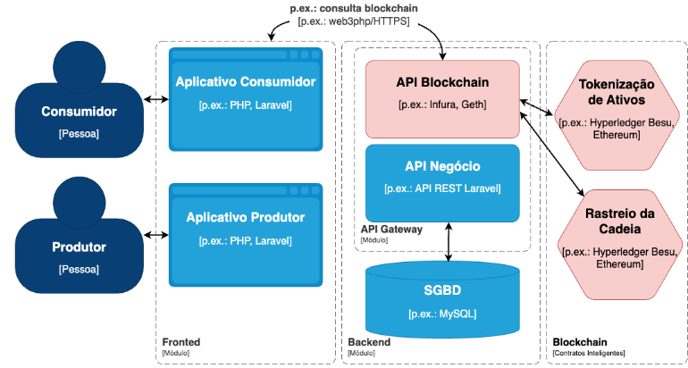

<h1 align="center">
   GT-Smart AgroRAF
</h1>
<h2 align="center">
  Smart Contracts para Rastreamento da Agricultura Familiar
</h2>

<h1 align="left">Objetivo:</h1>

O nosso objetivo geral é desenvolver uma solução de rastreamento de produtos da agricultura familiar baseada em blockchains e tokens em acordo com a INC 02/2018. Delineamos três objetivos específicos:
<ol>
   <li>Projeto de contratos inteligentes para rastreamento da agricultura familiar. Projetar os contratos inteligentes considerando as necessidades de tokenização e rastreabilidade. </li>
   <li> Implementação de contratos inteligentes para agricultura familiar. Acoplar o sistema de informação à blockchain. Esta etapa envolve atividades de análise, projeto, implementação e testes de interface de usuário conectadas ao Hyperledger Besu disponibilizado na infraestrutura desenvolvida no contexto do projeto Ilíada.</li>
   <li>Teste de blockchains para os contratos inteligentes da agricultura familiar Planejar, executar e analisar resultados de avaliação sistemática de alternativas de blockchain como substrato para a solução proposta. São previstas avaliação das redes Hyperledger Besu e Ethereum considerando métricas de custo, tempo de inserção,  taxa de transações por segundo (TPS) e usabilidade. Os resultados fornecerão subsídios técnicos e econômicos concretos para avaliar a viabilidade prática e a escalabilidade da solução, fundamentando um estudo econômico para um futuro MVP.</li>
</ol>

<h2>Equipe: </h2>

<h2>Instituições: </h2>

<table style="width: 100%; height: 100%; text-align: center; vertical-align: middle;">
    <tr>
        <td></td>
        <td></td>
        <td></td>
        <td></td>
    </tr>
</table>

<h2>Arquitetura: </h2>

   
   

<h2>Contatos: </h2>

<a href="mailto:diegokreutz@unipampa.edu.br">
    Diego Kreutz
</a>
 
<a href="mailto:rodrigomansilha@unipampa.edu.br">
    Rodrigo Mansilha
</a>
 
<a href="mailto:roben@lunardi.inf.br">
    Roben Lunardi
</a>
 
<a href="mailto:rafaelnogueira.aluno@unipampa.edu.br">
    Rafael Nogueira
</a>
 
<a href="mailto:fanhenrique@gmail.com">
    Henrique Fan
</a>
 
<a href="mailto:bneves.dev@gmail.com">
    Bruno Neves
</a>
 
