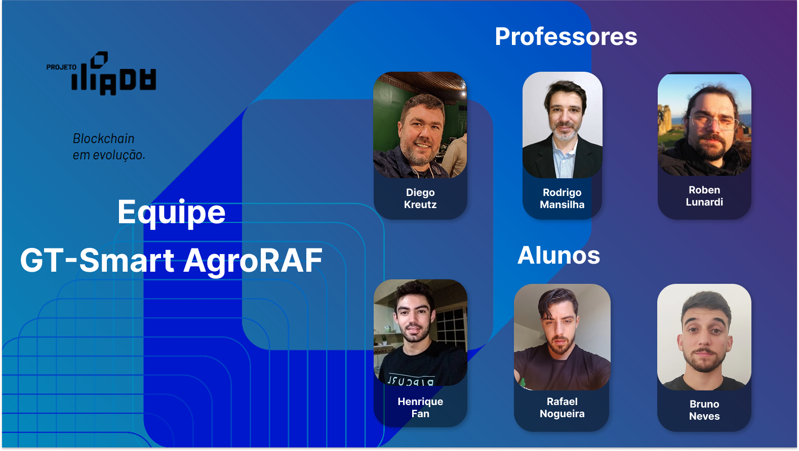
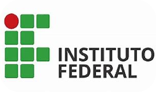
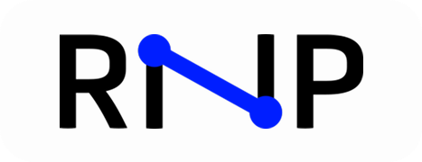

<h1 align="center">
   GT-Smart AgroRAF
</h1>
<h2 align="center">
  Smart Contracts para Rastreamento da Agricultura Familiar
</h2>

<h1 align="left">O que é:</h1>

Lorem yplisun,Lorem yplisunLorem yplisunLorem yplisunLorem yplisunLorem yplisunLorem yplisunLorem yplisunLorem yplisunLorem yplisun, Lorem yplisunLorem yplisunLorem yplisun , Lorem yplisunLorem yplisunLorem yplisun, Lorem yplisun 

<h1 align="left">Resumo do Projeto:</h1>

Lorem yplisun,Lorem yplisunLorem yplisunLorem yplisunLorem yplisunLorem yplisunLorem yplisunLorem yplisunLorem yplisunLorem yplisun, Lorem yplisunLorem yplisunLorem yplisun , Lorem yplisunLorem yplisunLorem yplisun, Lorem yplisun 

<h2>Equipe: </h2>

<h2>Instituições: </h2>

<table style="width: 100%; height: 100%; text-align: center; vertical-align: middle;">
    <tr>
        <td></td>
        <td></td>
        <td></td>
        <td></td>
    </tr>
</table>

<h2>Voluntários: </h2>

Fábio Righi

<h2>Tecnologias: </h2>
<table style="width: 100%; height: 100%; text-align: center; vertical-align: middle;">
 <tr>
     <td></td>
 </tr>
</table>
